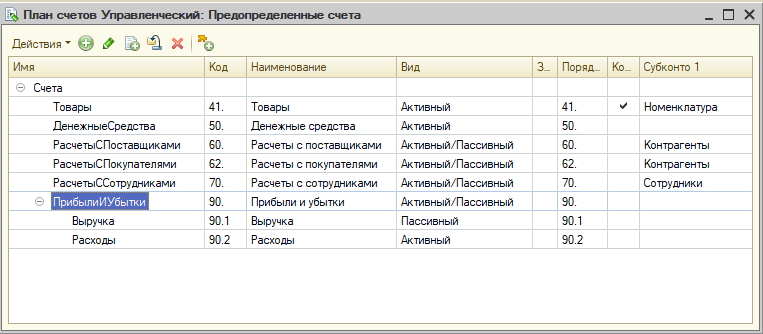

### Учёт

Все добавляемые объекты включаем в новую подсистему **Учёт**, выведенную в командный интерфейс.

1. Добавить план видов характеристик **ВидыСубконто**:
  * тип значения характеристик — составной (СправочникСсылка.Контрагенты, СправочникСсылка.Номенклатура, СправочникСсылка.Сотрудники);
  * Представление объекта — «Вид субконто»;
  * Три предопределенных элемента:
      * контрагенты (СправочникСсылка.Контрагенты);
      * номенклатура (СправочникСсылка.Номенклатура);
      * сотрудники (СправочникСсылка.Сотрудники).

2. Добавить план счетов **Управленческий**:
  * длина кода — 4, наименования — 50;
  * маска кода — «##.#», автопорядок по коду, ширина порядка — 4;
  * добавить признак учёта **Количественный** для учёта по количеству на единственном счёте **Товары**;
  * в качестве видов субконто указать созданный на предыдущем шаге ПВХ **ВидыСубконто**. Максимальное количество видов субконто — 1;
  * добавить предопределённые счета:
    * активный 41 **Товары** (виды субконто: Номенклатура, учёт по количеству);
    * активный 50 **ДенежныеСредства**;
    * активно-пассивный 60 **РасчетыСПоставщиками** (виды субконто: Контрагенты);
    * активно-пассивный 62 **РасчетыСПокупателями** (виды субконто: Контрагенты);
    * активно-пассивный 70 **РасчетыССотрудниками** (виды субконто: Сотрудники);
    * активно-пассивный 90 **ПрибылиИУбытки** с субсчетами:
      * пассивный 90.1 **Выручка**;
      * активный 90.2 **Расходы**;
  * в итоге план счетов должен выглядеть так:

3. Добавить регистр бухгалтерии **Управленческий**:
  * с учётом по плану счетов **Управленческий**;
  * с корреспонденцией;
  * с ресурсами:
    * **Сумма** (ОпределяемыйТип.Сумма);
    * **Количество** (ОпределяемыйТип.Количество) — с признаком учета **Количественный** и со снятым флажком **Балансовый**;
  * в регистраторы добавить документы:
    * **ПоступлениеТоваровИУслуг**,
    * **РеализацияТоваровИУслуг**,
    * **ПоступлениеДенежныхСредств**,
    * **СписаниеДенежныхСредств**.

4. Доработать обработчик проведения документа **ПоступлениеТоваровИУслуг**:
  * для строк с номенклатурой вида Товар формировать движение Дт **Товары** с заполнением субконто Номенклатура — Кт **РасчетыСПоставщиками** с заполнением субконто Контрагенты на сумму строки;
  * для строк с номенклатурой вида Услуга формировать движение Дт **Расходы** — Кт **РасчетыСПоставщиками** с заполнением субконто Контрагенты на сумму строки.
    
5. Доработать обработчик проведения документа **РеализацияТоваровИУслуг**:
  * формировать движение Дт **РасчетыСПокупателями** с заполнением субконто Контрагенты — Кт **Выручка** на общую сумму продажи (по всем строкам);
  * для строк с номенклатурой вида Товар формировать движение Дт **Расходы** — Кт **Товары** с заполнением субконто Номенклатура на сумму себестоимости списанного товара. Себестоимость должна рассчитываться по данным регистра бухгалтерии, а не по данным регистра накопления **Товары**. Данные регистра бухгалтерии нужно получать запросом к виртуальной таблице **РегистрБухгалтерии.Управленческий.Остатки** на МоментВремени() проводимого документа. При списании необходимо проверять, что количества товара достаточно для списания.

6. Доработать документ **ПоступлениеДенежныхСредств**:
  * тип реквизита **Плательщик** сделать составным и расширить его типом **СправочникСсылка.Сотрудники**;
  * при проведении формировать движения в Дт **ДенежныеСредства** и Кт:
    * для плательщиков-контрагентов — **РасчетыСПокупателями** с заполнением субконто **Контрагенты**;
    * для плательщиков-сотрудников — **РасчетыССотрудниками** с заполнением субконто **Сотрудники**.
      
7. Доработать документ **СписаниеДенежныхСредств**:
  * тип реквизита **Получатель** сделать составным и расширить его типом **СправочникСсылка.Сотрудники**;
  * при проведении формировать движения с Кт **ДенежныеСредства** и в Дт:
    * для получателей-контрагентов — **РасчетыСПоставщиками** с заполнением субконто **Контрагенты**;
    * для получателей-сотрудников — **РасчетыССотрудниками** с заполнением субконто **Сотрудники**.
      
8. Добавить отчёт **ОборотноСальдоваяВедомость** («Оборотно-сальдовая ведомость»):
  * создать основную схему компоновки данных, а в ней — набор данных-запрос;
  * в запрос конструктором добавить виртуальную таблицу **РегистрБухгалтерии.Управленческий.ОстаткиИОбороты** с параметрами &НачалоПериода и &КонецПериода;
  * в качестве полей выбрать:
    * будущие группировки **Счет** и **Субконто1**;
    * будущие ресурсы:
      * **СуммаНачальныйОстатокДт** и **СуммаНачальныйОстатокДт**,
      * **СуммаОборотДт** и **СуммаОборотКт**,
      * **СуммаКонечныйОстатокДт** и **СуммаКонечныйОстатокКт**;
  * на закладке «Ресурсы» добавить три пары ресурсов с функцией по умолчанию **Сумма** и прочими настройками по умолчанию;
  * на закладке «Настройки»:
    * добавить группирровку **Счет** (с иерархией), а под ней — **Субконто1** (без иерархии);
    * добавить ресурсы, сгруппировав их в группы «Начальный остаток», «Оборот», «Конечный остаток», и дав краткие заголовки «Дт» и «Кт» вместо избыточных «СуммаНачальныйОстатокДт» и т. д.:

    * Параметры **НачалоПериода** и **КонецПериода** включите в пользовательские настройки с быстрым доступом;
  * сформировав движения документами по всем счетам, проверьте отчёт. Он должен выглядеть примерно так:
  
