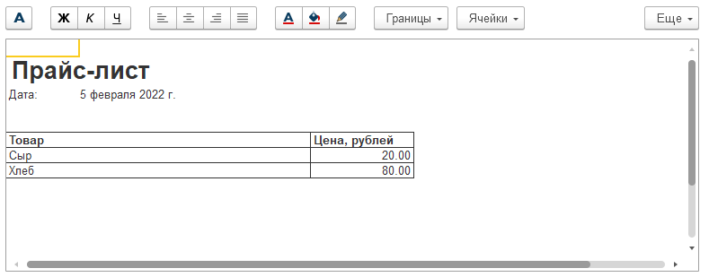

# Задание к занятию «Табличные и текстовые документы»

Результат выполнения двух задач вышлите одним файлом (.dt).

## Задача 1. Создать команду печати прайс-листа в справочнике «Номенклатура» в табличный документ.

### Описание задачи

Добавить возможность формирования прайс-листа в справочнике «Номенклатура».

### Требования к результату

Выгрузка информационной базы (.dt) с конфигурацией из предыдущих заданий имеет возможность формировать прайс-лист из формы списка номенклатуры.

Прайс формируется на основе выделенных строк в форме списка «Номенклатура».

Цена номенклатуры определяется на текущую дату.

Можно выделить одну или несколько строк для формирования печатной формы.

### Процесс выполнения

1. Добавим общий макет «МакетПрайсЛист» с типом Табличный документ.

	Создадим в нём области:
	- «ШапкаПрайса» с полем «Дата»;
	- «ТабличнаяЧастьЗаголовок» с именами колонок, которые будут выводится на печать;
	- «ТабличнаяЧастьСтрока» с полями «Товар» и «Цена».

2. В форму списка номенклатуры добавим команду «Прайс-лист».

3. Для печати добавим процедуру на клиенте:
```bsl
&НаКлиенте
Процедура КомандаПрайсЛист(Команда)
	
	//выделим несколько строк
	МассивСтрок = Элементы.Список.ВыделенныеСтроки;
	//отправим выделенные строки номенклатуры на печать
	ПечатнаяФорма = ПечатнаяФормаПрайсЛист(МассивСтрок);
	ПечатнаяФорма.Показать("Прайс-лист");
	
КонецПроцедуры
```
4. На сервере формируем печатную форму и возращаем на клиент для печати:

```bsl
&НаСервере
Функция ПечатнаяФормаПрайсЛист(МассивСтрок)
	
	ПечатнаяФорма = Новый ТабличныйДокумент;
	ПечатнаяФорма.ОтображатьСетку = Ложь;
	ПечатнаяФорма.ОтображатьЗаголовки = Ложь;
	
	Макет = ПолучитьОбщийМакет("МакетПрайсЛист");
	
	// Получаем область шапки и макета по имени
	Шапка = Макет.ПолучитьОбласть("ШапкаПрайса");
	// Заполняем параметр Дата
	Шапка.Параметры.Дата = ТекущаяДата();
	// Выводим область в документ
	ПечатнаяФорма.Вывести(Шапка);
	
	// Получаем область заголовка
	ТабличнаяЧастьЗаголовок = Макет.ПолучитьОбласть("ТабличнаяЧастьЗаголовок");
	ПечатнаяФорма.Вывести(ТабличнаяЧастьЗаголовок);
	
	// Получаем область строк для формирования табличной части в цикле
	ТабличнаяЧастьСтрока = Макет.ПолучитьОбласть("ТабличнаяЧастьСтрока");
	
	Для каждого СтрокаСписка из МассивСтрок Цикл
		ТабличнаяЧастьСтрока.Параметры.Номенклатура = СтрокаСписка; 
		ТабличнаяЧастьСтрока.Параметры.Цена = 100; //Здесь необходимо получить текущую цену товара и установить ее  
		ПечатнаяФорма.Вывести(ТабличнаяЧастьСтрока);
	КонецЦикла;
	
	// Возвращаем печатную форму обратно на клиент
	Возврат ПечатнаяФорма;
	
КонецФункции
```

5. Получим срез последних по регистру сведений «Цены номенклатуры» для заполнения цены и вставим в соответствующий параметр.

Примерный внешний вид печатной формы, которая должна получиться:



## Задача 2. Создать обработку для загрузки прайса из файла Excel (*.xlsx)

### Описание задачи

Создадим обработку для загрузки цен из файла xlsx.

Обработка создаёт новый документ «Цены номенклатуры» в табличной части и заполняет данные из файла.

### Требования к результату

Выгрузка информационной базы (.dt).

Файл для тестирования загрузки: [homework-5-8-price](reference-data/homework-5-8-price.xlsx).

Возможность выбора файла с фильтром *.xlsx, обработка файла должна выполняться на сервере.

Возможность загрузить и создать документ «Цены номенклатуры».

Поиск номенклатуры по наименованию

Если не найдена, вывести сообщение вида
«Номенклатура: « + НаименованиеНоменклатуры + » не найдена».

### Процесс выполнения

Создать новую обработку «Загрузка прайса из файла xlsx».

Добавим команду «Загрузить», вынесем в командную панель формы и назначим кнопкой по умолчанию.
Назначим обработчик команды со следующим алгоритмом:
```bsl	
	ПараметрыПомещенияФайла = Новый ПараметрыДиалогаПомещенияФайлов;  
	ПараметрыПомещенияФайла.Фильтр = НСтр("ru = 'Файл xlsx'; en = 'File xlsx'")
		+ "(*.xlsx)|*.xlsx";
	ОписаниеФайла = Ждать ПоместитьФайлНаСерверАсинх(,,, ПараметрыПомещенияФайла, УникальныйИдентификатор);
	
	Если ОписаниеФайла = Неопределено Тогда
		Возврат;
	КонецЕсли;
	
	Если ОписаниеФайла.ПомещениеФайлаОтменено Тогда
		Возврат;
	КонецЕсли;
	
	ВыполнитьЗагрузкуНаСервере(ОписаниеФайла.Адрес);
```
Так как в обработчике используется ключевое слово «Ждать», перед словом «Процедура» добавим **Асинх**.

Далее на сервере сохраним данные во временный файл, прочитаем и обработаем данные с помощью табличного документа:
```bsl
&НаСервере
Процедура ВыполнитьЗагрузкуНаСервере(Адрес)
	
	Данные = ПолучитьИзВременногоХранилища(Адрес);
	ИмяПромежуточногоФайла = ПолучитьИмяВременногоФайла("xlsx");
	Данные.Записать(ИмяПромежуточногоФайла);
	
	ТабличныйДокумент = Новый ТабличныйДокумент;
	ТабличныйДокумент.Прочитать(ИмяПромежуточногоФайла);
	
	// Создадим новый документ - реализуйте здесь соответствующий алгоритм   
	
	// Начинаем со 2 строки т.к. в 1-й заголовки колонок
	Для Сч = 2 По ТабличныйДокумент.ВысотаТаблицы Цикл 
		ИмяНоменклатуры = ТабличныйДокумент.Область(Сч, 1).Текст;
		Цена = ТабличныйДокумент.Область(Сч, 2).Текст;		
		
		Номенклатура = Справочники.Номенклатура.НайтиПоНаименованию(ИмяНоменклатуры);
		
		Если Не ЗначениеЗаполнено(Номенклатура) Тогда
			
			ШаблонСообщения = НСтр("ru = 'Номенклатура: %1 не найдена'");
			
			Сообщение = Новый СообщениеПользователю;
			Сообщение.Текст = СтрШаблон(ШаблонСообщения, ИмяНоменклатуры);
			Сообщение.Сообщить();
			
			Продолжить;
			
		КонецЕсли;
		
		// Добавим в документ новую строку табличной части - реализуйте здесь соответствующий алгоритм     
		
	КонецЦикла;
	
	// Запишем документ - реализуйте здесь соответствующий алгоритм
	
	УдалитьФайлы(ИмяПромежуточногоФайла);
	
КонецПроцедуры
```

Реализуем в процедуре ВыполнитьЗагрузкуНаСервере алгоритм по созданию, заполнению и записи документа на основании данных табличного документа.

Перед записью документа проверим заполнение документа. Если не заполнены обязетльные реквизиты или нет ни одной строки в табличной части выведем ошибку и не будем записывать документ.

### Подсказка: [результат выполнения домашнего задания](Examples/homework-5-8-example.md).
